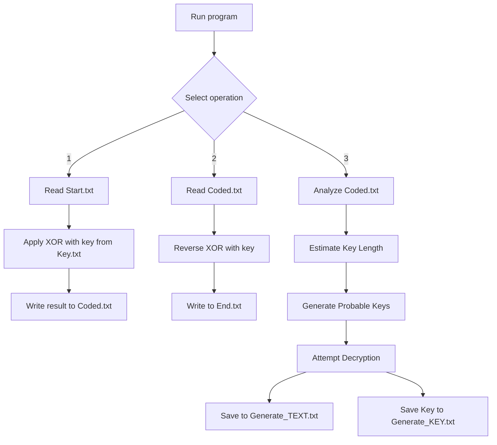

# CodeDecodeWithWithoutKey

This is a C program to encrypt and decrypt text using the XOR cipher. It supports keyed encoding, known key decoding, and keyless decoding attempts by analyzing the ciphertext.

## Features

- **Encryption**: Encodes text from `Start.txt` using the key from `Key.txt`, saves the result to `Coded.txt`
- **Decryption with key**: Decodes text from `Coded.txt` using the known key from `Key.txt`, saves the result to `End.txt`
- **Decryption without key**:
- Analyzes `Coded.txt` to estimate the key length (match index method)
- Generates probable keys
- Attempts to restore the original text
- Saves results to `Generate_TEXT.txt` and probable key to `Generate_KEY.txt`
- **Interface menu**: Console menu in Russian
- **Language support**: Works with English and Russian alphabets, special characters

## Requirements

- **Windows OS** (uses Windows-specific features)
- **Microsoft C/C++ compiler** (`cl.exe`)
- **CMake** (version 3.10 or higher)
- **Input files** in the same directory:
- `Start.txt` - source text
- `Key.txt` - encryption key
- `Coded.txt` - encrypted text (for decryption)

## Usage

1. Compile the program with CMake:
```bash
cmake .
cmake --build .
```

2. Run the executable file:
```bash
.\CodeDecodeWithWithoutKey.exe
```

3. Select an option from the menu:
```
1) Encrypt
2) Decrypt with key
3) Decrypt without key
4) Exit
```

## How it works



## Limitations

- **Windows Only**: Uses Windows system functions (`system("cls")`, `system("pause")`)
- **Requires Files**: No error handling if files are missing
- **Estimate Key Length**: Works with probability threshold `PROBABILITY = 0.046`
- **Interface Language**: Russian only
- **Key Recovery**: Assumes frequent use of spaces in text

## Sample Files

### Start.txt
```
Hello, World! This is a test.
```

### Key.txt
```
secret
```

### Coded.txt (after encryption)
```
[binary data]
```

### End.txt (after decryption with key)
```
Hello, World! This is a test.
```

## Setup

To support other languages, change the character sets in the code:
```c
const char ALPHABET_EN[] = "abcdefghijklmnopqrstuvwxyzABCDEFGHIJKLMNOPQRSTUVWXYZ";
const char ALPHABET_RU[] = "абвгдеожзийклмнопрстуфхцчшщъыьэюяАБВГДЕЁЖЗИЙКПМНКЛЫНЫЬЭЮЯ";
const char SPECIAL[] = " .,!?;:'\"-()@#$%^&*+=<>[]{}|\\/~`_";
```

## License

Project without a license - free use and modification are allowed.

---

> **Note**: For better key recovery, configure the parameters:
> - `PROBABILITY` - probability threshold
> - `BLOCK_SIZE` - size of analysis blocks
> - `GENERATION` - number of generated keys
